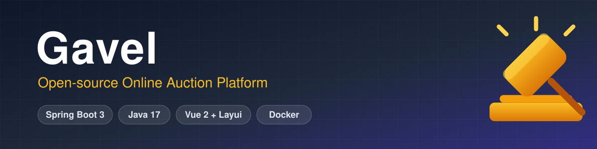
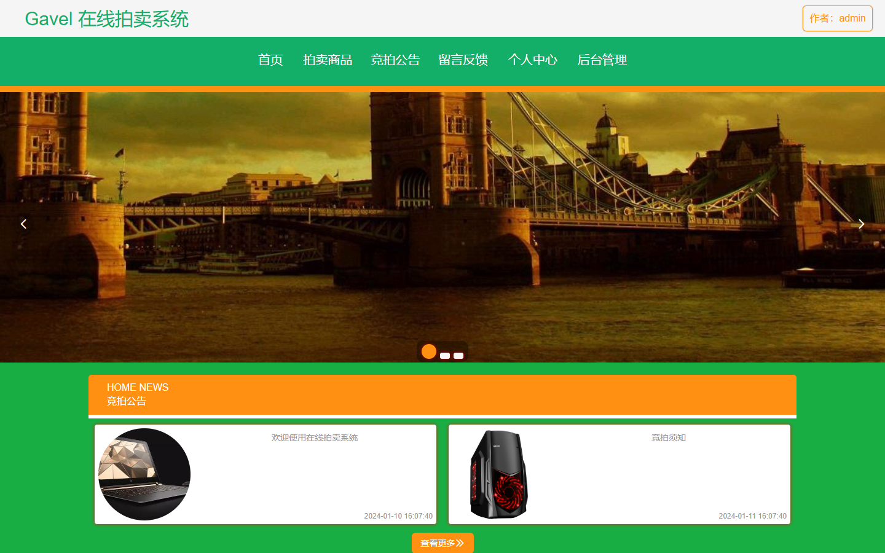
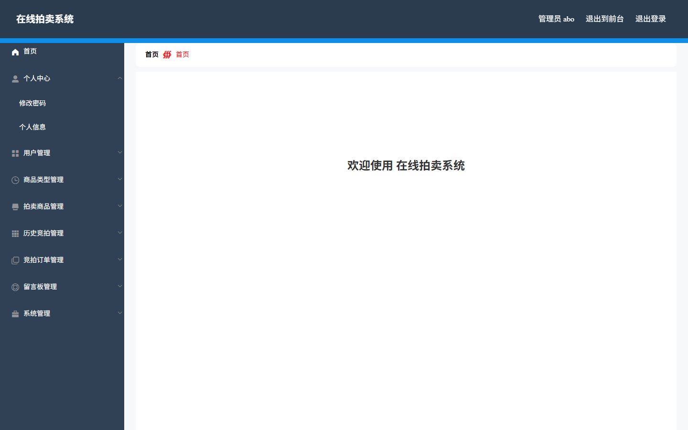
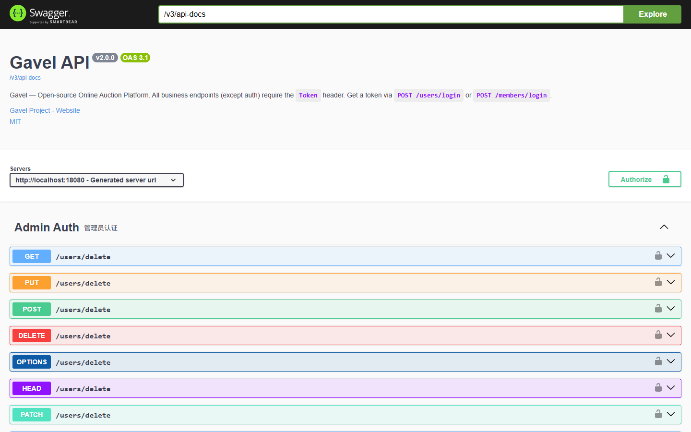
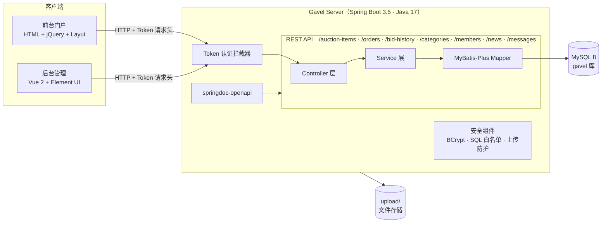

<div align="center">



# Gavel

**开源在线拍卖平台**

*一把为学习而铸的拍卖槌 — Spring Boot 3 · Java 17 · Vue 2*

[](.github/workflows/ci.yml)
[](https://openjdk.org/projects/jdk/17/)
[](https://spring.io/projects/spring-boot)
[](LICENSE)
[](CONTRIBUTING.md)

**[English](README.md)** | **[简体中文](README.zh-CN.md)**

</div>

---

**Gavel** 是一个功能完整的全栈在线拍卖平台：管理员发布拍卖商品，用户参与竞拍并支付订单，成交的竞拍全部进入历史竞拍审核流程，所有角色通过统一 Token 认证。

项目原型是一个经典的 Java 毕业设计代码库，经过**深度重造**：技术栈现代化、安全全面加固、REST 接口英文化、交互式 API 文档、一条命令的 Docker 部署。它既适合作为 Spring Boot 3 的学习参考，也适合研究"一个遗留项目如何被专业地修复"。

## 📸 系统截图

| 前台门户 | 拍卖商品 |
|---|---|
|  |  |

| 后台管理 | Swagger 文档 |
|---|---|
|  |  |

## ✨ 功能特性

**前台（游客/用户）**
- 浏览拍卖商品、竞拍公告、商品分类筛选
- 注册 / 登录 / 个人中心
- 竞拍下单、历史竞拍记录、留言反馈

**后台（管理员）**
- 用户管理、商品类型管理、拍卖商品管理
- 历史竞拍审核、竞拍订单管理、留言板管理
- 轮播图 / 系统配置管理

**工程化**
- 交互式 API 文档（Swagger UI）+ Actuator 健康检查
- 22 个单元测试覆盖安全关键路径，CI 自动执行
- 多阶段 Docker 镜像（非 root 运行），一条命令启动完整技术栈
- GitHub 社区健康文件：Issue 表单、PR 模板、Dependabot

## 🏗 系统架构



除认证接口外，所有请求先经过 Token 拦截器；业务数据存于 MySQL，上传文件落在 `upload/` 目录。

## 🛠 技术栈

| 层次 | 技术 |
|------|------|
| 后端 | Spring Boot 3.5 · Java 17 · MyBatis-Plus 3.5 |
| 数据库 | MySQL 8.x |
| API 文档 | springdoc-openapi（Swagger UI）· Actuator 健康检查 |
| 安全 | BCrypt 密码哈希 · Token 拦截认证 · 表/列白名单 |
| 后台前端 | Vue 2 + Element UI（已构建 dist，可直接使用） |
| 前台前端 | 原生 HTML + jQuery + Layui |
| 部署 | Docker · docker-compose · GitHub Actions CI |

## 🚀 快速开始

### 方式一：Docker 一键启动（推荐）

```bash
# 在项目根目录执行（自动建库、导数据、启动应用）
docker compose up -d
docker compose logs -f app
```

### 方式二：本地运行

1. 准备 MySQL 8.x，执行根目录 `db.sql` 初始化数据库
2. 修改 `server/src/main/resources/application.yml` 中的数据库账号密码
3. 构建并运行（需 JDK 17 + Maven 3.9+）：

```bash
cd server
mvn clean package -DskipTests
java -jar target/gavel-server-2.0.0.jar
```

也可以使用 Makefile：`make docker-up` / `make run` / `make db-init`。

### 访问地址

| 端 | 地址 | 默认账号 |
|----|------|----------|
| API 文档（Swagger） | http://localhost:8080/swagger-ui.html | — |
| 健康检查 | http://localhost:8080/actuator/health | — |
| 后台管理 | http://localhost:8080/admin/dist/index.html | `abo` / `abo` |
| 前台门户 | http://localhost:8080/front/index.html | `demo` / `demo123` |

> ⚠️ 首次部署后请立即修改默认密码。

> 种子数据中部分图片路径指向 `/upload/...`。本开源发布包不包含运行期上传文件，因此部分演示图片可能暂时缺失；可在后台重新上传图片，或将自己的演示文件放入运行期 `upload/` 目录。

## 📚 API 一览

所有接口位于根路径下（无 context-path）。除登录注册外，所有请求需携带登录接口返回的 `Token` 请求头。

| 资源 | 路径 | 说明 |
|------|------|------|
| 认证（管理员） | `/users/login`、`/users/register`、`/users/session` | 表单传参 |
| 认证（用户） | `/members/login`、`/members/register`、`/members/session` | 表单传参 |
| 拍卖商品 | `/auction-items/page` `/list` `/info/{id}` `/save` `/update` `/delete` | |
| 竞拍订单 | `/orders/...` | 同上 CRUD 形态 |
| 历史竞拍 | `/bid-history/...` | |
| 商品类型 | `/categories/...` | |
| 用户 | `/members/...` | |
| 竞拍公告 | `/news/...` | |
| 留言板 | `/messages/...` | 需登录 |
| 文件 | `/file/upload`、`/file/download/{fileName}` | 扩展名白名单 |
| 下拉选项 | `/option/{table}/{column}` | 仅白名单表 |

可在 **`/swagger-ui.html`** 交互式浏览全部接口。

## 🧪 测试

```bash
cd server
mvn test
```

测试套件聚焦本次重造引入的安全关键路径：

| 测试类 | 验证内容 |
|--------|----------|
| `SQLFilterTest` | 标识符校验拒绝注入载荷；白名单拦截生效 |
| `CommonControllerWhitelistTest` | 动态查询接口只暴露白名单内的表/列组合 |
| `FileUploadWhitelistTest` | 上传拒绝 `exe`、`sh`、`bat`、`jsp`、`war`、`jar`、`php`、`html` |
| `PasswordVerificationTest` | BCrypt 校验 + 历史明文透明升级 |
| `RTest` | 统一响应包装契约 |

## 🏗 项目结构

```
.
├── db.sql                    # 建库脚本 + 演示数据（utf8mb4，全部虚构身份）
├── docker-compose.yml        # MySQL 8 + 应用，一条命令
├── Makefile                  # build / run / db-init / docker 快捷命令
├── .env.example              # 环境变量模板
├── .github/                  # CI、Issue 表单、PR 模板、Dependabot
├── docs/                     # banner、logo、截图
└── server/                   # Spring Boot 后端（内嵌前后台前端）
    ├── pom.xml               # dev.gavel:gavel-server:2.0.0
    ├── Dockerfile            # 多阶段构建，非 root 运行
    └── src/
        ├── main/
        │   ├── java/com/gavel/
        │   │   ├── controller/   # REST 接口层
        │   │   ├── service/      # 业务逻辑层
        │   │   ├── dao/          # MyBatis-Plus Mapper
        │   │   ├── entity/       # 实体（entity/vo/view/model）
        │   │   ├── config/       # 分页/CORS/OpenAPI/全局异常
        │   │   ├── interceptor/  # Token 认证拦截器
        │   │   └── utils/        # 工具类
        │   └── resources/
        │       ├── mapper/       # MyBatis XML
        │       ├── admin/        # Vue2 后台管理端（源码 + dist）
        │       └── front/        # jQuery 前台门户
        └── test/java/com/gavel/  # JUnit 5 安全测试
```

## 🔒 安全加固说明

本次重造修复了原代码库安全审计发现的全部问题：

| 问题 | 原版 | 现版 |
|------|------|------|
| SQL 注入 | 通用接口接受任意表/列名且免登录 | 表/列白名单 + 标识符校验 |
| 任意文件上传 | 不校验扩展名 | 扩展名白名单 + UUID 文件名 + 路径穿越防护 |
| 密码存储 | 明文保存 | BCrypt（登录自动升级历史明文） |
| 匿名重置密码 | 任何人可重置管理员密码为 123456 | 需登录后操作 |
| CORS | 回显任意 Origin + 允许凭据 | 配置化白名单 |
| 响应泄露 | 密码/身份证直接回传 | 接口层脱敏 |
| 高危依赖 | fastjson 1.2.8（RCE）、Shiro 1.3.2 | 全部移除，改用 Jackson + spring-security-crypto |

漏洞反馈流程见 [SECURITY.md](SECURITY.md)，完整变更历史见 [CHANGELOG.md](CHANGELOG.md)。

## ❓ 常见问题

<details>
<summary><b>代码里为什么还有 <code>paimaishangpin</code> 这类拼音命名？</b></summary>

数据库表名、列名和实体类名有意保留原拼音标识，便于与原毕设代码做 schema 级对照；REST API、包名和所有用户可见层面已全部英文化。物理 schema 重命名会破坏所有既有部署，且"遗留 schema + 现代 API"本身就是一个有价值的研究样本。
</details>

<details>
<summary><b>可以直接上生产吗？</b></summary>

不建议。这是一个教学项目，安全虽已大幅加固，但生产使用还需补齐密钥管理、TLS、限流、审计日志、数据库备份等。请阅读下方免责声明。
</details>

<details>
<summary><b>管理员密码忘了怎么重置？</b></summary>

所有演示密码都是 <code>db.sql</code> 中的 BCrypt 哈希。重新导入种子数据（<code>make db-init</code> 或 docker compose down/up）即可恢复 <code>abo/abo</code>，登录后请在后台修改密码。
</details>

<details>
<summary><b>页面能打开但图片裂图。</b></summary>

图片以相对路径（<code>/upload/...</code>）解析，请确认是通过服务器访问（http://localhost:8080/front/index.html）而不是直接双击磁盘上的 HTML 文件，并确认种子数据已导入。
</details>

<details>
<summary><b>能用 MySQL 5.7 吗？</b></summary>

compose 技术栈和 CI 以 8.x 为准。DDL 比较保守，5.7 大概率可用但未做验证，推荐 8.x。
</details>

<details>
<summary><b>8080 端口被占用了。</b></summary>

用 <code>java -jar target/gavel-server-2.0.0.jar --server.port=18080</code> 或设置 <code>SERVER_PORT</code> 启动。两个前端都会动态探测当前 origin，无需重新构建。
</details>

## 📦 后台前端开发模式（可选）

```bash
cd server/src/main/resources/admin/admin
npm install
npm run serve    # 开发热更新
npm run build    # 产出 dist
```

## 🗺 Roadmap

- [x] Spring Boot 3 / Java 17 现代化
- [x] 安全加固（BCrypt、白名单、上传防护、CORS）
- [x] REST 接口英文化 + Swagger UI
- [x] Docker 一键部署
- [x] 测试套件 + CI
- [ ] WebSocket 实时竞价（被超价提醒）
- [ ] 定时拍卖截拍 + 自动结算
- [ ] 对象存储适配器（S3 / OSS）
- [ ] JWT + 刷新令牌（与现有不透明 Token 并存）
- [ ] 前台界面国际化
- [ ] 后台管理端迁移 Vue 3

欢迎为任意 Roadmap 项提交 PR，参见 [CONTRIBUTING.md](CONTRIBUTING.md)。

## ⚠️ 免责声明

- 本项目仅供学习交流使用，生产环境使用请自行完成全面安全评估。
- 数据库中的演示数据（姓名、手机号、身份证号）均为虚构。
- 请勿将本系统用于任何违反法律法规的用途。

## 🤝 参与贡献

欢迎提 Issue 和 PR！请先阅读 [CONTRIBUTING.md](CONTRIBUTING.md)。安全漏洞请走 [SECURITY.md](SECURITY.md) 中的流程，请勿公开提 Issue。

## 📄 开源协议

[MIT License](LICENSE)
